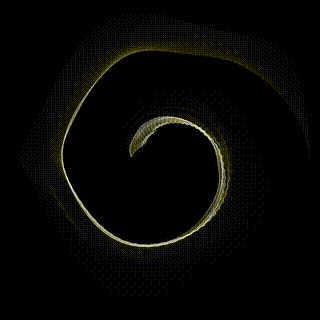
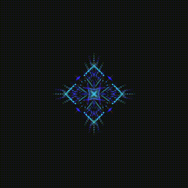
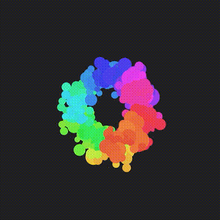
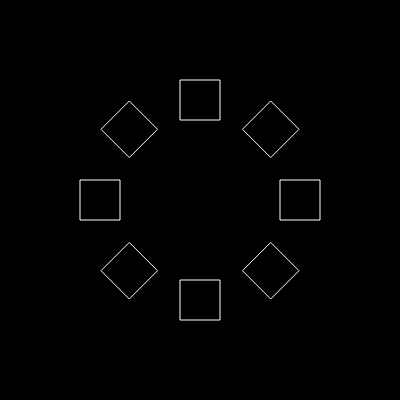

## Synopsis

This library is based on the [Urpflanze](https://github.com/urpflanze-org/urpflanze) package for generate the scene.

It deals with creating two-dimensional shapes, repeating them, manipulating them point by point and encapsulating them.

## Motivations

The creation of this library comes from the need to create simple APIs for
manage the repetition of primitive shapes and the possibility of applying transformations to each of them, applying transformations on the points avoiding the use of canvas transformations.

Another need - which then became one of the main features - was to be able to encapsulate the result of a generation and manage it as if it were a new shape.

## Donate

I am trying to create a tool for those who want to approach the world of programming
or for programmers who want to approach the world of creative coding.

I have spent a lot of time and will spend more to support this project.
I also have in mind a **[web editor](https://github.com/urpflanze-org/editor)** (open-source) where you can use the features of this library in the browser.

You can see a preview [here](https://editor.urpflanze.org)

[](https://www.paypal.me/genbs)
[](https://ko-fi.com/urpflanze)

[](https://explorer.btc.com/btc/address/1CSQq4aMmsA71twvyZHZCjmeB2AmQGCPNq)
[](https://etherscan.io/address/0x9086c4bb7015c1d6dc79162d02e7e1239c982c01)

---

##

|                                                          |                                                              |                                                       |
| :------------------------------------------------------: | :----------------------------------------------------------: | :---------------------------------------------------: |
|        |  |       |
|  |       |  |

---

## Installation

The most immediate way to include Urpflanze in your project is to use an online hosted version.

### CDN

Full version

```html
<script src="https://cdn.jsdelivr.net/npm/@urpflanze/js"></script>
```

Customizable version

```html
<script src="https://cdn.jsdelivr.net/npm/@urpflanze/js[@version]/build/urpflanze[-light][.min].js"></script>
```

### NPM

To install it just run the command:

```sh
npm i --save @urpflanze/js
```

At the end you can include Urpflanze in your code

```javascript
import * as Urpflanze from '@urpflanze/js'

const scene = new Urpflanze.Scene()

// or

import { Scene } from '@urpflanze/js'

const scene = new Scene()
```

_use `urpflanze/dist/index-light` for light version_

## Example

### Hello Rect!

```javascript
const scene = new Urpflanze.Scene()

const rect = new Urpflanze.Rect({
	repetitions: 8,
	distance: 100,
	sideLength: 20,
})
scene.add(rect) // Add rect to scene

const drawer = new Urpflanze.DrawerCanvas(scene, document.body)
drawer.draw() // Draw scene on canvas
```

### Output



---

## [Full docs and Examples](https://docs.urpflanze.org/urpflanze/)

---

### [Core](https://github.com/urpflanze-org/core) · [DrawerCanvas](https://github.com/urpflanze-org/drawer-canvas) · [Animation](https://github.com/urpflanze-org/animation)
